## 前言
# 爱快软路由性能监视器
> 本项目是基于路由监视器 [shelo/RouterMonitor](https://gitee.com/dannylsl/routermonitor) 的二次开发，通过构造登录请求，实现了对爱快软路由的原生支持。
> 对于 OpenWrt、Linux 服务器、NAS 等环境，也支持通过 Docker 容器 NetData 获取数据源。

# 先上图

| 爱快监控效果 |
|---|
| 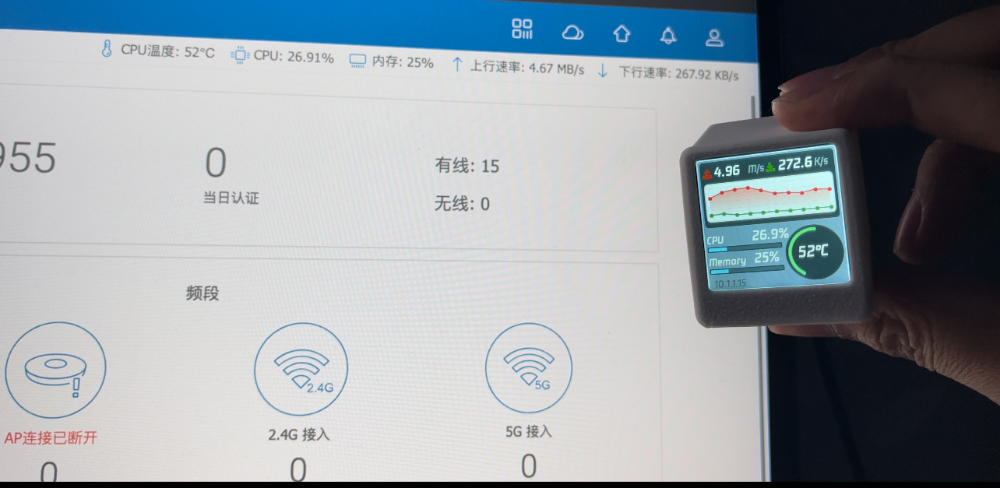 |

# 启动流程

1. 开机显示转圈加载页
2. 后台非阻塞连接 WiFi
3. WiFi 连接成功后切换到监控主页面
4. 向爱快路由器登录一次，获取 `sess_key` cookie
5. 之后每秒调用 `/Action/call` 刷新 CPU、内存、温度、网速等数据

> 登录只在开机时执行一次，不会每秒重复登录。

***

# 路由监视器 RouterMonitor
[[toc]]

## 前言
> 这个项目当前功能还比较简单，配置功能的完善比我预期的要麻烦，但是耐不住大家都很期待，因此就先开源再完善，有能力的小伙伴可以先玩起来，也欢迎贡献 PR。

作者是一个对监测类软件情有独钟的人，比如 Windows 上常用 Traffic Monitor，Mac 就用腾讯的柠檬助手，会把网速、CPU 占用、温度等信息挂在菜单栏，以此来作为一些程序是否正常运行的判断依据。

年初的时候意外接触到了 ESP8266 做的墨水屏日历，后来家里添置了软路由后，便想着能不能做一个监视屏，然后就做了这个。起初的版本还没有图表，后来看到了 Unify 路由器的小屏幕，便增加了图表功能。

## 先上图
| RouterMonitor | 皮卡丘涂装 |
|---|---|
| 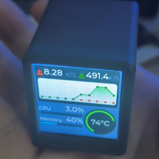 |  |

- [RouterMonitor 演示视频](https://www.bilibili.com/video/BV1km4y1L7YY/)
- [皮卡丘演示视频](https://www.bilibili.com/video/BV1BM4y1W78d/)

# 硬件资料

由于最初对这个功能的定位就是监视屏，也比较了市面上很多开源项目，出于成本考虑选择了 SD2 小电视的方案：
https://oshwhub.com/Q21182889/esp-xiao-dian-shi

## 其他参考开源项目
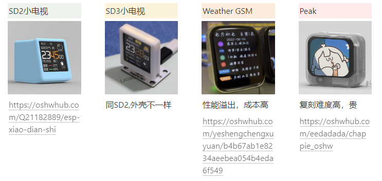
- **Weather GSM** https://oshwhub.com/yeshengchengxuyuan/b4b67ab1e8234aeebea054b4eda6f549
- **Peak** https://oshwhub.com/eedadada/chappie_oshw

# 软件

## 爱快数据源（默认模式）

设备通过 HTTP 接口访问爱快路由器：

| 步骤 | 接口 | 说明 |
|---|---|---|
| 登录 | `POST /Action/login` | 使用用户名密码换取 `sess_key` |
| 拉取数据 | `POST /Action/call` | 携带 cookie 获取 `sysstat` 监控数据 |

登录时设备会自动生成爱快要求的加密字段：

| 字段 | 生成方式 |
|---|---|
| `username` | 明文用户名 |
| `passwd` | `MD5(密码)`，32 位小写十六进制 |
| `pass` | `base64("salt_11" + 密码)` |

不再需要像旧版那样从浏览器 F12 复制加密 JSON。

## NetData 数据源（可选模式）

将 `main.ino` 中 `isIkuai` 设为 `false` 即可切换为 NetData 模式。

https://www.netdata.cloud/

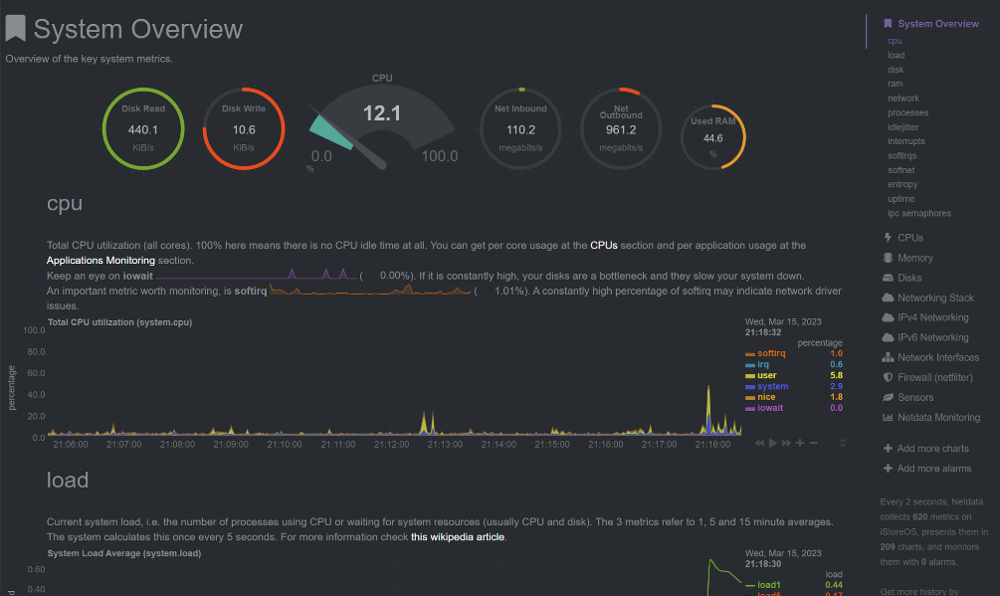

NetData 提供了 Web API 用于获取数据信息：https://learn.netdata.cloud/docs/rest-api/api

| 数据信息 | 接口 |
|---|---|
| CPU 数据 | `/api/v1/data?chart=system.cpu&after=-10&format=array&points=10` |
| 内存占用 | `/api/v1/data?chart=mem.available&format=array&points=1&group=average` |
| 网速监控-下行 | `/api/v1/data?chart=net.eth0&format=array&after=-10&points=10&dimensions=received` |
| 网速监控-上行 | `/api/v1/data?chart=net.eth0&format=array&after=-10&points=10&dimensions=sent` |
| 温度信息 | `/api/v1/data?chart=system.cpu&after=-10&format=array&points=10` |

## UI 界面绘制 LVGL

参考官方文档：https://docs.lvgl.io/7.11/

由于 ESP8266 使用的 LVGL 版本比较低，无法使用官方的 UI 制作工具 [SquareLine Studio](https://squareline.io/)，所以只能看文档手写界面。

# 环境配置

Windows 和 Mac 都可以配置，M1 也可以。这里以 Windows 为例。

## 0. 硬件购买

提供了三种方案和成本供大家评估选择：

- **简单模式**：小电视硬件成品可以去淘宝/咸鱼/PDD 搜 SD2 小电视，一般价格在 50 左右
  > 请务必跟卖家确认小电视是否带 CH340 芯片，支持自己烧录固件
- **中等难度**：ESP8266 开发板 + 1.3 寸 TFT 屏幕 + 数据线，大概 30 元，没有外壳
- **困难等级**：嘉立创打板 + 购买零件 + 3D 外壳打印，成本最高

## 1. CH340 驱动安装

### 1.1 驱动下载安装

https://www.wch.cn/downloads/category/67.html?feature=USB%E8%BD%AC%E4%B8%B2%E5%8F%A3&product_name=CH340

根据自己的平台下载对应版本然后安装。

### 1.2 检验安装是否成功

使用 USB 数据线连接小电视或开发板，如果资源管理器里可以看到新增串口，说明安装成功。

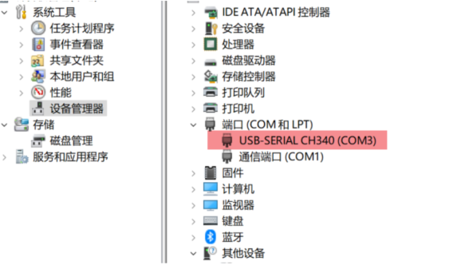

## 2. 开发环境搭建

1. 安装 Visual Studio Code
2. 安装插件 PlatformIO

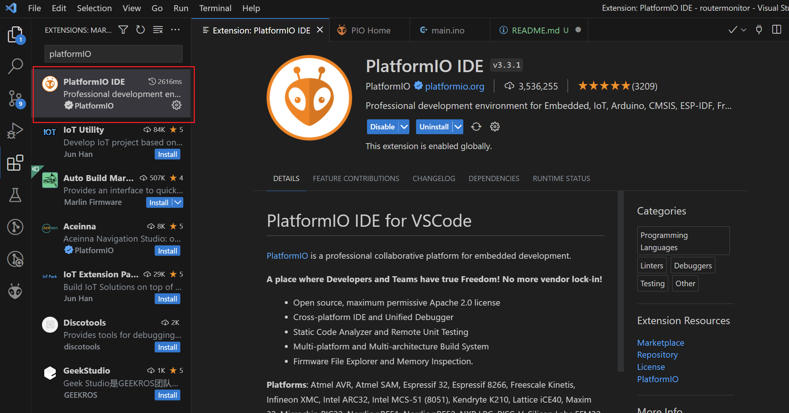

3. Clone 代码，然后打开项目目录

```bash
git clone git@github.com:if8336/IKuaiMonitor.git
cd IKuaiMonitor
```

## 3. 修改代码配置

主要配置文件：

- `src/main.ino`：WiFi、爱快账号、页面逻辑
- `src/NetData.h`：爱快/NetData 网络请求封装

> 请勿将真实 WiFi 密码、路由器账号密码提交到公开仓库。

### 3.1 修改 WiFi

编辑 `src/main.ino`：

```cpp
const char* ssid = "YourWiFi-SSID";
const char* password = "your-wifi-password";
```

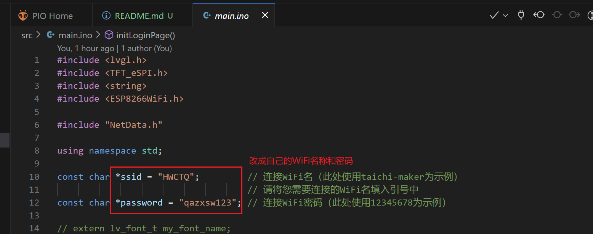

### 3.2 修改爱快路由器地址

编辑 `src/NetData.h`：

```cpp
const char* SERVER_ADDRESS = "10.1.1.1";
```

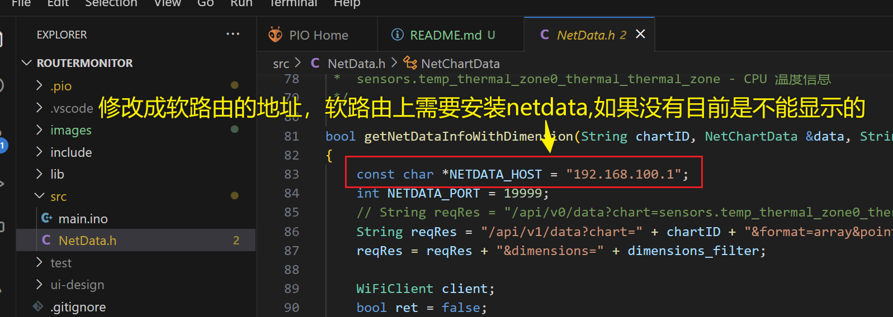

### 3.3 修改爱快登录账号

编辑 `src/main.ino`：

```cpp
const char* ikuaiUsername = "admin";
const char* ikuaiPassword = "your-password";
```

设备启动时会自动按爱快规则生成登录请求，无需手动抓包。

建议在爱快中新建一个**最小权限**账号，例如：

- 状态监控（仅访问）

### 3.4 NetData 模式额外配置

如果使用 NetData 模式，将 `main.ino` 中：

```cpp
constexpr bool isIkuai = false;
```

并按实际情况修改内存相关配置，参见 [Issue](https://gitee.com/dannylsl/routermonitor/issues/I7QX5V)。

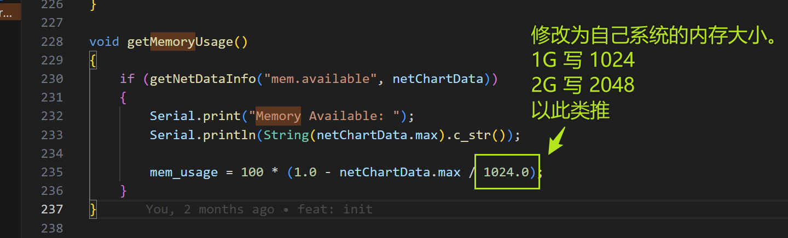

## 4. 编译并烧录

1. USB 连接小电视或开发板
2. 终端执行：

```bash
pio run --target upload
```

3. 查看串口日志：

```bash
pio device monitor
```

也可以在 VSCode 左侧 PlatformIO 面板点击 `Upload and Monitor`。

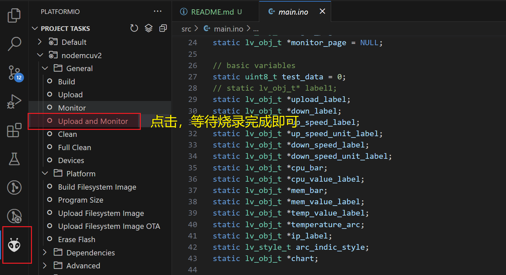

# FAQ

## 1. 烧录后温度信息不显示（NetData 模式）

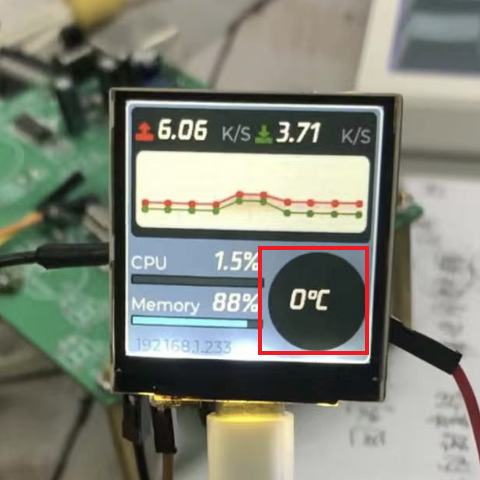

参考资料：https://hiwbb.com/2021/10/openwrt-netdata-show-temperature/

原因：
1. `netdata.conf` 中关闭了插件 chart 的显示
2. 基础软件 `coreutils-timeout` 未安装

解决办法（登录 OpenWrt 终端）：

1. 安装 timeout：`opkg install coreutils-timeout`
2. 进入 `/etc/netdata`
3. 使用 `./edit-config charts.d.conf` 编辑配置，在最后加入 `sensors=force`
4. 用 `/usr/lib/netdata/plugins.d/charts.d.plugin sensors` 测试
5. 编辑 `/etc/netdata/netdata.conf`，把 `charts.d = no` 改为 `charts.d = yes` 或注释掉
6. 重启 netdata：`/etc/init.d/netdata restart`

## 2. NetData 温度显示正常，但 monitor 依旧不显示

如果 NetData 已经能够正常显示温度，大概率是 monitor 请求的温度 key 不对。不同系统版本对应的 key 存在差异，从 NetData 中找到温度曲线的 key，替换到 `getTemperature()` 的请求参数中。

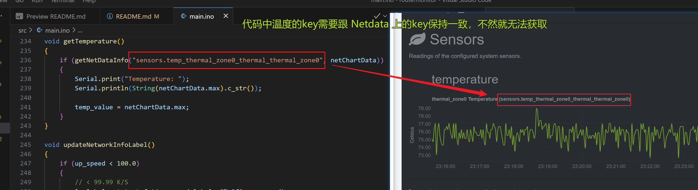

## 3. 屏幕一直转圈但串口已有数据

通常是 WiFi 已连接但页面未切换。请确认已使用最新代码，并检查串口是否打印 `Connection established!`。

## 4. 爱快登录失败

请检查：

1. `SERVER_ADDRESS` 是否为路由器实际管理地址
2. 设备与路由器是否在同一局域网
3. 爱快账号密码是否正确
4. 账号是否具备状态监控访问权限
